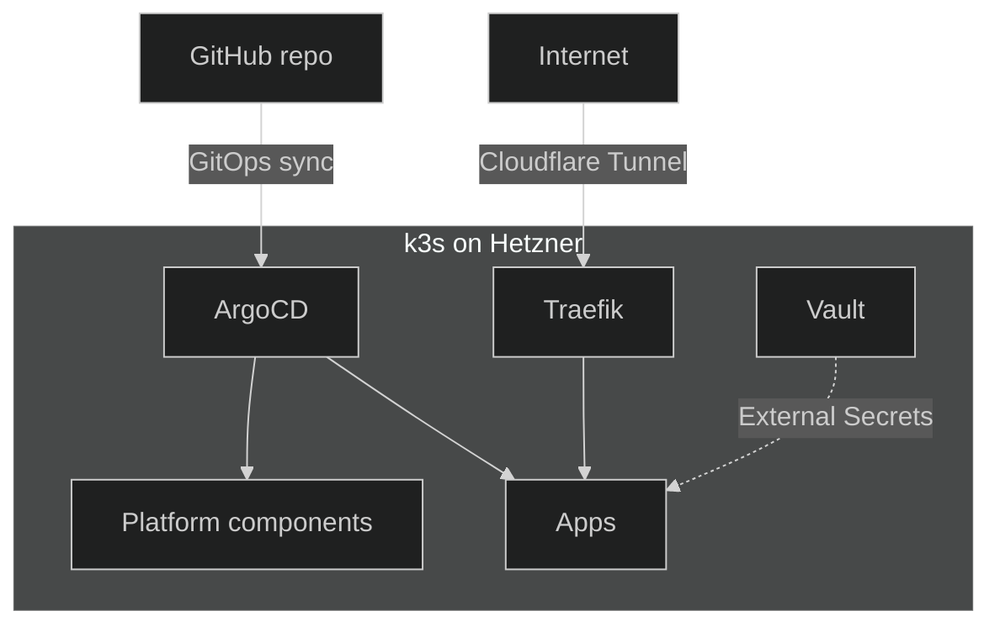

## What is Nexus?

Nexus is a personal internal developer platform to deploy apps in production and experiment with
modern tooling and technologies. It runs on a
<a href="https://k3s.io/" target="_blank" rel="noopener">k3s</a> cluster on
<a href="https://www.hetzner.com/cloud" target="_blank" rel="noopener">Hetzner Cloud</a>,
provisioned with
<a href="https://developer.hashicorp.com/terraform" target="_blank" rel="noopener">Terraform</a> and
reconciled continuously from Git via
<a href="https://argo-cd.readthedocs.io/" target="_blank" rel="noopener">ArgoCD</a>.

The cluster has no open inbound ports — [Traffic](../platform/traffic/01-overview.md) covers how
requests still reach it. Secrets stay out of Git, materialised at runtime from
[Vault](../platform/secrets/01-overview.md). Every component past that is chosen deliberately: see
the domain pages below for the why behind each one.

## Where to go next

- [Local development](02-local-development.md) — prerequisites and how to run the whole stack on
  your machine.
- [Cluster & Compute](../platform/cluster/01-overview.md) — provisioning, upgrades, CNI,
  autoscaling.
- [Traffic & Access](../platform/traffic/01-overview.md) — how a request or an operator reaches the
  cluster, and TLS/ingress once inside.
- [Delivery](../platform/delivery/01-overview.md) — GitOps, CI/CD, how a commit turns into a running
  change.
- [Databases](../platform/databases/01-overview.md) — the shared Postgres pattern, backups, restore,
  hibernation.
- [Secrets](../platform/secrets/01-overview.md) — Vault + External Secrets.
- [Observability](../platform/observability/01-overview.md) — metrics, logs, dashboards.

Ongoing work and planned improvements are tracked as
<a href="https://github.com/kbntx-org/nexus/issues" target="_blank" rel="noopener">GitHub issues</a>
— the docs describe the platform as it stands today, not the roadmap.
