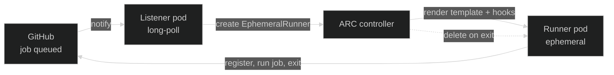
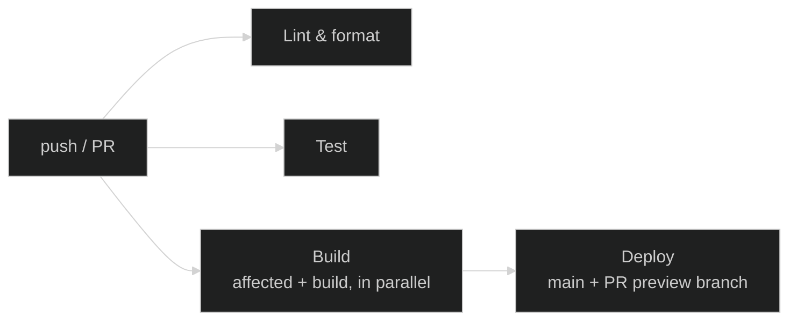

## Why GitHub Actions

CI/CD runs on
[GitHub Actions](https://docs.github.com/en/actions){ target="\_blank" rel="noopener" }.
A few reasons drive the choice:

- **Colocated with the source.** Nexus is already hosted on GitHub, so
  CI lives next to the code, the PRs, and the issues — one platform, one
  set of permissions, no extra integration to wire up.
- **Best PR experience on the market.** Tight integration with branch
  protection, review tooling, status checks, and reusable workflows. The
  developer flow stays inside the same UI as the code.
- **Native fit with Kubernetes.** Pipelines run on **self-hosted runners
  inside the cluster** — no external CI provider, no per-minute billing,
  and CI compute is part of the same GitOps-managed workload as everything
  else.

## Runners

CI jobs are executed by
[Actions Runner Controller (ARC)](https://github.com/actions/actions-runner-controller){ target="\_blank" rel="noopener" },
a Kubernetes operator that creates an **ephemeral runner pod** for each job
and deletes it when the job finishes.

A workflow opts into the in-cluster runners by targeting the registered
runner scale set:

```yaml
jobs:
  build:
    runs-on: nexus-org-runners
```

`nexus-org-runners` is the
[`runnerScaleSetName`](https://github.com/kbntx-org/nexus/blob/main/platform/core/github-arc-runners/runners/values.yaml){ target="\_blank" rel="noopener" }
exposed by the runner chart. No per-job `container:` override is needed —
the runner pod itself runs the [CI toolkit image](#ci-toolkit-image), so
every tool a workflow needs is already on the pod that executes it.

### How ARC works

Two long-lived components run in the cluster: a **controller** that
watches the runner-scale-set CRDs, and a **listener** pod per scale set
that holds an HTTPS long-poll connection to GitHub. When GitHub queues a
job for `nexus-org-runners`, the flow is:



The runner pod is **single-use**: once the job finishes, the pod is
discarded. There is no shared state between jobs, no warm caches between
runs, and no opportunity for one job to leave behind something that
affects the next one.

The pool size scales between `minRunners` and `maxRunners` (configured in
the [runner values](https://github.com/kbntx-org/nexus/blob/main/platform/core/github-arc-runners/runners/values.yaml){ target="\_blank" rel="noopener" }):
the listener creates new ephemeral runners as jobs queue up, the
controller materializes them as pods, and idle slack is pruned back down.

### Dedicated node pool

Runner pods schedule onto a **dedicated node pool**. The runner spec sets
a `nodeSelector` (`pool: ci-runners`) and tolerates a matching taint, so:

- CI workloads cannot land on application nodes
- Application workloads cannot land on runner nodes
- Resource pressure from a noisy job stays within its blast radius

### Docker-in-Docker sidecar

There is no job-container hook mechanism, and no separate pod is created
for Docker actions or `docker` commands in a step. Each runner pod is a
**single pod** with two containers sharing the same ephemeral work
volume: `runner`, which runs the job, and `dind`, a rootless
[Docker-in-Docker](https://hub.docker.com/_/docker){ target="\_blank" rel="noopener" }
sidecar. `DOCKER_HOST` on the `runner` container points at the sidecar's
rootless socket, so `docker build`, Docker actions, and service
containers all work without the pod itself needing privileged mode.

Because the pod is single-use and discarded once the job finishes, there
is no image or container state carried between jobs — every run starts
from the same clean sidecar.

- **Network isolation.** The runner pod carries a `github-job-pod: 'true'`
  label. A
  [`CiliumNetworkPolicy`](https://github.com/kbntx-org/nexus/blob/main/platform/core/github-arc-runners/runners/templates/network-policy.yaml){ target="\_blank" rel="noopener" }
  selects on that label and restricts egress to DNS (`kube-system`) and
  the public internet — the cluster's other namespaces are denied.
  Runners execute arbitrary user-authored code (workflow YAML, pulled
  actions, build scripts), so treating them as untrusted is the safe
  default. In practice, a runner can pull from GitHub, push to a
  registry, or call ArgoCD over its public ingress, but it cannot reach
  other in-cluster services directly.

## CI toolkit image

Every workflow runs on one image,
[`kbntx-org/nexus-ci-toolkit`](https://github.com/kbntx-org/nexus/tree/main/platform/core/github-arc-runners/base-image){ target="\_blank" rel="noopener" },
built directly on top of the
[GitHub Actions runner image](https://github.com/actions/runner/pkgs/container/actions-runner){ target="\_blank" rel="noopener" }
and layered with every tool the pipelines need: `pnpm`, `kubectl`, the
ArgoCD CLI, `jq`, and so on. It is not a separate
job container — it **is** the runner's own image, so the tools are
already there the moment the pod starts.

This avoids per-job setup steps (no `setup-node`, no `setup-go`, no
manual installs) and keeps the workflow files short. When a tool needs to
be added, it goes into the toolkit image and every workflow benefits at
once.

## Pipelines

The pipelines are composed of a small set of reusable workflows that
[`checks.yml`](https://github.com/kbntx-org/nexus/blob/main/.github/workflows/checks.yml){ target="\_blank" rel="noopener" }
orchestrates. It is the single entrypoint for both pull requests and
pushes to `main` — there is no separate PR/main workflow pair. Each
called workflow branches on `github.event_name` internally where its
behavior needs to differ, and independent jobs (`lint-and-format`,
`test`, `build`) run in parallel rather than chained.



### On every trigger

A pull request and a push to `main` both run:

1. **Lint & format** — `nx affected --target=lint` plus `nx format:check`
   on a PR, or the `--all` equivalents on `main`.
2. **Test** — `nx affected --target=test` on a PR, or `nx run-many
--target=test --all` on `main`.
3. **Build** — figure out which Nx projects are affected (as a step, not
   a separate job — see below), then build (and, outside a PR, push) the
   portfolio and documentation images as parallel steps in the same job.
   See [GitOps deploys](02-gitops-deploys.md). On a PR the images are
   built but never pushed, so a broken Dockerfile still fails the check
   without publishing anything.

On a pull request, branch protection blocks merging until lint, test,
and build all pass.

### Main-only continuation

On a push to `main`, once lint/test/build succeed, the **deploy** job
commits the new image tags to a separate manifests repo, and ArgoCD
deploys via auto-sync. The full flow is documented in
[GitOps deploys](02-gitops-deploys.md).

## Affected detection

[Nx](https://nx.dev/){ target="\_blank" rel="noopener" } already knows the
project graph and can answer "what changed since `<base>`?". The CI
pipelines lean on that for two distinct decisions:

- **What to lint and test** — straightforward `nx affected` against the
  base branch.
- **What to deploy** — Nx affected, _plus_ any project whose declared
  **deploy paths** intersect the changed files. This catches changes that
  Nx alone cannot see, like a Helm chart edit or a workflow tweak that
  should still trigger a redeploy.

Each project declares its deploy paths in its `project.json` under
`metadata.deployPaths`, and the
[`compute-affected`](https://github.com/kbntx-org/nexus/blob/main/.github/actions/compute-affected/action.yaml){ target="\_blank" rel="noopener" }
composite action walks them with the changed file list to build
`deploy_targets`. It runs as a step inside the `build` job — not its own
job — since it has exactly one caller and starting a separate runner pod
for it would just add latency. On `main`, the diff base for
image-shipping apps is **that app's last deployed SHA** (read from the
manifests repo), not the previous commit — this prevents parallel merges
from cross-referencing each other's in-flight images. See
[GitOps deploys](02-gitops-deploys.md) for the full mechanics.

The action also has a fail-safe: if any pipeline-critical file changes
(the action itself, `build.yml`, or `deploy.yml`), it marks **every
application** as a deploy target — the assumption being that a change to
the build/deploy logic is risky enough to warrant a full re-deploy.

## References

- [`platform/core/github-arc-runners/`](https://github.com/kbntx-org/nexus/tree/main/platform/core/github-arc-runners){ target="\_blank" rel="noopener" } — ARC controller and runner Helm charts
- [`platform/core/github-arc-runners/runners/templates/network-policy.yaml`](https://github.com/kbntx-org/nexus/blob/main/platform/core/github-arc-runners/runners/templates/network-policy.yaml){ target="\_blank" rel="noopener" } — runner egress restrictions
- [`platform/core/github-arc-runners/base-image/`](https://github.com/kbntx-org/nexus/tree/main/platform/core/github-arc-runners/base-image){ target="\_blank" rel="noopener" } — CI toolkit image
- [`.github/workflows/`](https://github.com/kbntx-org/nexus/tree/main/.github/workflows){ target="\_blank" rel="noopener" } — workflow definitions
- [`.github/actions/compute-affected/action.yaml`](https://github.com/kbntx-org/nexus/blob/main/.github/actions/compute-affected/action.yaml){ target="\_blank" rel="noopener" } — affected detection (per-app base from `nexus-manifests` on main)
