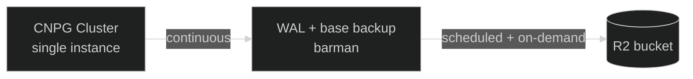

Every relational database in Nexus — Vault's KV backend, Grafana's state, n8n's workflow store —
runs on <a href="https://cloudnative-pg.io/" target="_blank" rel="noopener">CloudNativePG</a>
(CNPG), the Kubernetes-native Postgres operator.

## The shared shape

Each consumer's chart (Vault's
<a href="https://github.com/kbntx-org/nexus/blob/main/platform/core/vault/server/templates/postgres-cnpg.yaml" target="_blank" rel="noopener"><code>postgres-cnpg.yaml</code></a>,
monitoring's, n8n's) declares the identical pair of resources: a single-instance
`postgresql.cnpg.io/v1` `Cluster`, and a daily `ScheduledBackup` targeting it. Only the database
name, credentials secret, and storage size differ between them — copy the closest existing template
rather than writing a new one from scratch.

Backups ship via CNPG's
<a href="https://cloudnative-pg.io/documentation/current/backup_recovery/" target="_blank" rel="noopener">barman
integration</a> — continuous WAL archiving plus a full base backup on the `ScheduledBackup` CRD's
daily schedule, compressed and pushed to an R2 bucket. Retention is a few days, set on the
`Cluster`'s `backup.retentionPolicy`; credentials for the bucket come from each consumer's own
Vault-backed secret ([Secrets](../secrets/01-overview.md)), not a shared one — a compromised app
can't touch another app's backups.

**Every cluster here is single-instance.** There's no standby replica to fail over to, which is a
deliberate cost trade-off for a personal platform, and it means backups are the actual recovery
mechanism, not a belt-and-braces extra on top of HA.

**The data itself is not encrypted at rest.** Hetzner's block storage has no native
encryption-at-rest option, so the PVC backing each `Cluster` is plain — unlike Kubernetes `Secret`
objects, which k3s does encrypt at rest (see
[Secrets](../secrets/01-overview.md#encryption-at-rest)). Worth knowing before treating a Postgres
volume as equivalently protected.

## References

- <a href="https://github.com/kbntx-org/nexus/tree/main/platform/core/cloudnative-pg" target="_blank" rel="noopener"><code>platform/core/cloudnative-pg/</code></a>
  — the operator chart, installed once, used by every consumer below
- [Secrets](../secrets/01-overview.md) — where each consumer's backup/DB credentials actually live
