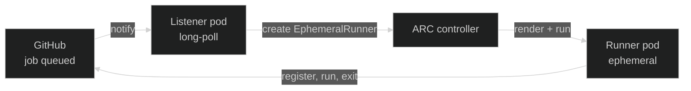
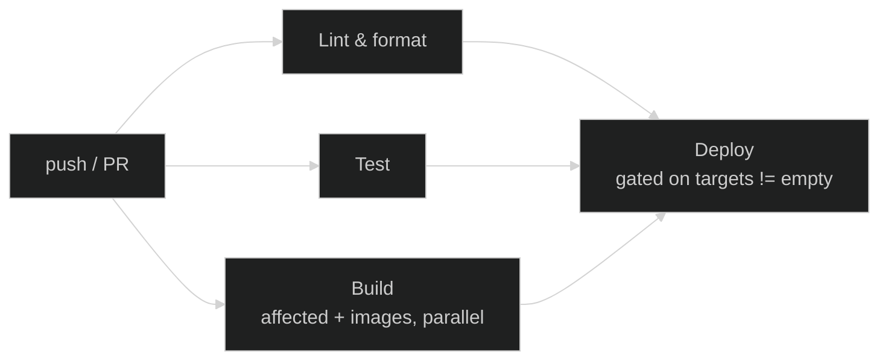

CI/CD runs on <a href="https://docs.github.com/en/actions" target="_blank" rel="noopener">GitHub
Actions</a>, colocated with the source, and executes on **self-hosted runners inside the cluster** —
CI compute is just another GitOps-managed workload, not an external provider with per-minute
billing.

## Runners

<a href="https://github.com/actions/actions-runner-controller" target="_blank" rel="noopener">Actions
Runner Controller (ARC)</a> creates an **ephemeral runner pod** per job and deletes it when the job
finishes. A workflow opts in by targeting a registered runner scale set
(`runs-on: nexus-org-runners`); the runner pod itself runs the CI toolkit image, so no per-job
`container:` override or tool install is needed.

The pod is single-use — no shared state, no warm caches, no risk of one job leaking into the next.

### Runner pools

Runner pods are organized into pools — one Helm release of the
<a href="https://github.com/kbntx-org/nexus/tree/main/platform/core/github-arc-runners/runner-scale-set" target="_blank" rel="noopener">runner-scale-set</a>
chart per pool, generated from a pool list in
<a href="https://github.com/kbntx-org/nexus/blob/main/platform/core/github-arc-runners/runners-generator/values.yaml" target="_blank" rel="noopener">runners-generator's
values</a> by an ArgoCD `ApplicationSet`. Each pool sets a distinct `nodeSelector` and tolerates a
matching taint, so CI and application workloads never compete for the same nodes and pools don't
contend with each other.

Most pools provision their nodes on demand via
[Karpenter](../cluster/01-overview.md#core-components), scaling node count with runner demand. One
pool (`ci-runners`) still runs on a statically provisioned Terraform node, for workloads that want
dedicated, always-on compute instead of a cold start.

### Docker-in-Docker, without `privileged: true`

Each runner pod is two containers on a shared volume: `runner` (the job) and a `dind` sidecar, with
`DOCKER_HOST` pointed at the sidecar's socket. `docker build`, Docker actions, and service
containers all work without either container running privileged — that's possible because the pod's
`runtimeClassName` is
<a href="https://github.com/nestybox/sysbox" target="_blank" rel="noopener">Sysbox</a>'s
`sysbox-runc`, not the default. Sysbox gives the container its own user-namespaced kernel-level
isolation, so a compromised build can't escalate off the node the way a privileged Docker-in-Docker
pod could — worth the extra isolation because runner pods execute arbitrary user-authored code
(workflow YAML, pulled actions, build scripts) and are treated as untrusted by default.

That untrusted-by-default posture extends to the network: a
<a href="https://github.com/kbntx-org/nexus/blob/main/platform/core/github-arc-runners/runner-scale-set/templates/network-policy.yaml" target="_blank" rel="noopener"><code>CiliumNetworkPolicy</code></a>
(one per pool) selects runner pods by label and restricts their egress to DNS and the public
internet — every other in-cluster namespace is denied. A runner can pull from GitHub, push to a
registry, or call ArgoCD over its public ingress; it cannot reach Vault, other apps, or anything
else on the cluster network directly.

## CI toolkit image

Every workflow runs on
<a href="https://github.com/kbntx-org/nexus/tree/main/platform/core/github-arc-runners/base-image" target="_blank" rel="noopener"><code>kbntx-org/nexus-ci-toolkit</code></a>,
built on the GitHub Actions runner image and layered with `pnpm`, `kubectl`, the ArgoCD CLI, and
everything else the pipelines need. It **is** the runner's image, not a separate job container, so
tools are already there when the pod starts — no `setup-node`, no per-job installs.

## Pipeline shape

<a href="https://github.com/kbntx-org/nexus/blob/main/.github/workflows/checks.yml" target="_blank" rel="noopener"><code>checks.yml</code></a>
is the single entrypoint for both pull requests and pushes to `main` — each called workflow branches
on `github.event_name` internally where behavior needs to differ, rather than living as a separate
PR/main file.

1. **Lint & format** — `nx affected` on a PR, the `--all` equivalent on `main`.
2. **Test** — same affected/all split.
3. **Build** — resolve affected + deploy targets (see below), then build — and, outside a PR, push —
   the portfolio, documentation, and cloudflare-controller images as parallel steps in one job. On a
   PR the images are built but never pushed, so a broken Dockerfile fails the check without
   publishing anything.
4. **Deploy** — only runs if lint and test succeeded and there's at least one deploy target; see
   [GitOps deploys](03-gitops-deploys.md) for the full mechanics.

Branch protection blocks merging a PR until lint, test, and build all pass.

## Affected detection

<a href="https://nx.dev/" target="_blank" rel="noopener">Nx</a> answers "what changed since
`<base>`", and the pipeline leans on it for two different questions: what to lint/test (plain
`nx affected` against the base branch), and what to _deploy_ — `nx affected`, plus any project whose
declared **deploy paths** (`project.json`'s `metadata.deployPaths`) intersect the changed files,
which catches changes Nx alone can't see, like a Helm chart edit.

The
<a href="https://github.com/kbntx-org/nexus/blob/main/.github/actions/compute-affected/action.yaml" target="_blank" rel="noopener"><code>compute-affected</code></a>
composite action runs as a step inside the build job (not its own job — it has one caller). On
`main`, the diff base for an image-shipping app is **that app's own last-deployed SHA**, read from
`nexus-manifests`, not the previous commit — see
[GitOps deploys](03-gitops-deploys.md#affected-detection-per-app) for why and for the fallback
cases. It also has a fail-safe: a change to a pipeline-critical file (the action itself,
`build.yml`, `deploy.yml`) marks every application as a deploy target, on the assumption that a
change to build/deploy logic is risky enough to warrant a full re-deploy.

## References

- <a href="https://github.com/kbntx-org/nexus/tree/main/platform/core/github-arc-runners" target="_blank" rel="noopener"><code>platform/core/github-arc-runners/</code></a>
  — ARC controller and runner Helm charts
- <a href="https://github.com/kbntx-org/nexus/blob/main/platform/core/github-arc-runners/runners-generator/values.yaml" target="_blank" rel="noopener"><code>platform/core/github-arc-runners/runners-generator/values.yaml</code></a>
  — the pool list
- <a href="https://github.com/kbntx-org/nexus/tree/main/platform/core/sysbox" target="_blank" rel="noopener"><code>platform/core/sysbox/</code></a>
  — Sysbox installer + `runtimeClassName`
- <a href="https://github.com/kbntx-org/nexus/blob/main/platform/core/github-arc-runners/runner-scale-set/templates/network-policy.yaml" target="_blank" rel="noopener"><code>platform/core/github-arc-runners/runner-scale-set/templates/network-policy.yaml</code></a>
  — runner-pod egress restriction
- <a href="https://github.com/kbntx-org/nexus/tree/main/platform/core/github-arc-runners/runner-scale-set" target="_blank" rel="noopener"><code>platform/core/github-arc-runners/runner-scale-set/</code></a>
  — chart deployed once per pool (runner spec, node pool, network policy)
- <a href="https://github.com/kbntx-org/nexus/tree/main/platform/core/github-arc-runners/base-image" target="_blank" rel="noopener"><code>platform/core/github-arc-runners/base-image/</code></a>
  — CI toolkit image
- <a href="https://github.com/kbntx-org/nexus/tree/main/.github/workflows" target="_blank" rel="noopener"><code>.github/workflows/</code></a>
  — workflow definitions
- <a href="https://github.com/kbntx-org/nexus/blob/main/.github/actions/compute-affected/action.yaml" target="_blank" rel="noopener"><code>.github/actions/compute-affected/action.yaml</code></a>
  — affected + deploy-target computation
