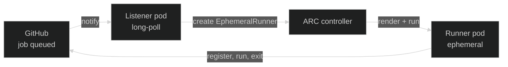
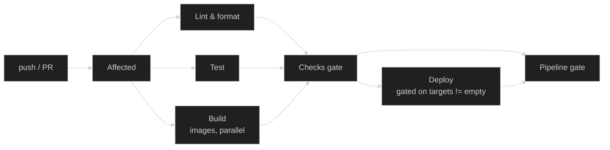
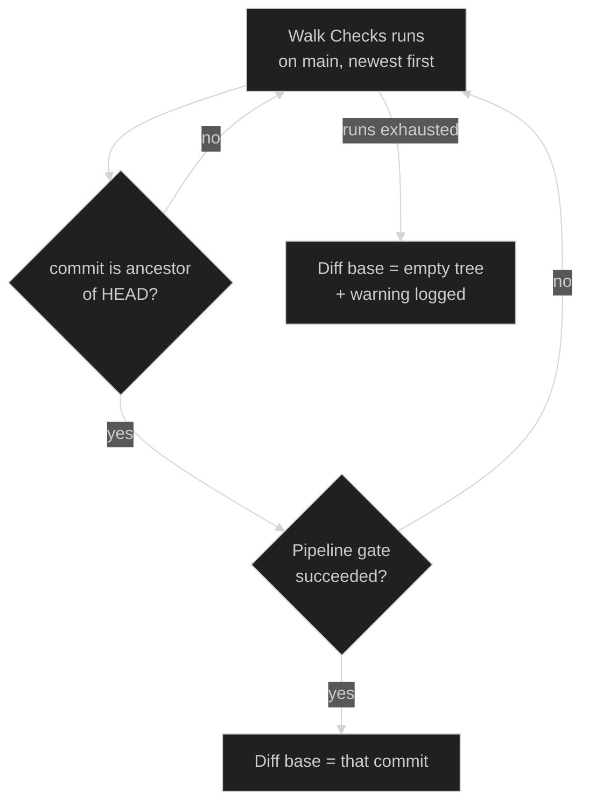

CI/CD runs on <a href="https://docs.github.com/en/actions" target="_blank" rel="noopener">GitHub
Actions</a>, colocated with the source, and executes on **self-hosted runners inside the cluster** —
CI compute is just another GitOps-managed workload, not an external provider with per-minute
billing.

## Runners

<a href="https://github.com/actions/actions-runner-controller" target="_blank" rel="noopener">Actions
Runner Controller (ARC)</a> creates an **ephemeral runner pod** per job and deletes it when the job
finishes. A workflow opts in by targeting a registered runner scale set
(`runs-on: nexus-org-runners`); the runner pod itself runs the CI toolkit image, so no per-job
`container:` override or tool install is needed.

The pod is single-use — no shared state, no warm caches, no risk of one job leaking into the next.

### Runner pools

Runner pods are organized into pools — one Helm release of the
<a href="https://github.com/kbntx-org/nexus/tree/main/platform/core/github-arc-runners/runner-scale-set" target="_blank" rel="noopener">runner-scale-set</a>
chart per pool, generated from a pool list in
<a href="https://github.com/kbntx-org/nexus/blob/main/platform/core/github-arc-runners/runners-generator/values.yaml" target="_blank" rel="noopener">runners-generator's
values</a> by an ArgoCD `ApplicationSet`. Each pool sets a distinct `nodeSelector` and tolerates a
matching taint, so CI and application workloads never compete for the same nodes and pools don't
contend with each other.

Most pools provision their nodes on demand via
[Karpenter](../cluster/01-overview.md#core-components), scaling node count with runner demand. One
pool (`ci-runners`) still runs on a statically provisioned Terraform node, for workloads that want
dedicated, always-on compute instead of a cold start.

### Docker-in-Docker, without `privileged: true`

Each runner pod is two containers on a shared volume: `runner` (the job) and a `dind` sidecar, with
`DOCKER_HOST` pointed at the sidecar's socket. `docker build`, Docker actions, and service
containers all work without either container running privileged — that's possible because the pod's
`runtimeClassName` is
<a href="https://github.com/nestybox/sysbox" target="_blank" rel="noopener">Sysbox</a>'s
`sysbox-runc`, not the default. Sysbox gives the container its own user-namespaced kernel-level
isolation, so a compromised build can't escalate off the node the way a privileged Docker-in-Docker
pod could — worth the extra isolation because runner pods execute arbitrary user-authored code
(workflow YAML, pulled actions, build scripts) and are treated as untrusted by default.

That untrusted-by-default posture extends to the network: a
<a href="https://github.com/kbntx-org/nexus/blob/main/platform/core/github-arc-runners/runner-scale-set/templates/network-policy.yaml" target="_blank" rel="noopener"><code>CiliumNetworkPolicy</code></a>
(one per pool) selects runner pods by label and restricts their egress to DNS and the public
internet — every other in-cluster namespace is denied. A runner can pull from GitHub, push to a
registry, or call ArgoCD over its public ingress; it cannot reach Vault, other apps, or anything
else on the cluster network directly.

## CI toolkit image

Every workflow runs on
<a href="https://github.com/kbntx-org/nexus/tree/main/platform/core/github-arc-runners/base-image" target="_blank" rel="noopener"><code>kbntx-org/nexus-ci-toolkit</code></a>,
built on the <a href="https://github.com/actions/runner" target="_blank" rel="noopener">official
GitHub Actions runner image</a> and layered with `pnpm`, Go, the Docker CLI, and everything else the
pipelines need. It **is** the runner's image, not a separate job container, so tools are already
there when the pod starts — no `setup-node`, no per-job installs.

Building that image is the one exception to "every workflow runs on it": you can't bootstrap an
image from the runner it produces, so
<a href="https://github.com/kbntx-org/nexus/blob/main/.github/workflows/build-docker-images.yml" target="_blank" rel="noopener"><code>build-docker-images.yml</code></a>
runs on a GitHub-hosted runner and installs Node/pnpm itself rather than inheriting them. Past that
bootstrapping step, it builds the toolkit image the same way any other image-shipping project does —
a `build-ci` Nx target — alongside other standalone base images that have no running Kubernetes
workload (the Sysbox installer, for one); an edit to one of their Dockerfiles rebuilds it through
the normal affected pipeline described below, and a nightly schedule additionally forces a full
rebuild of all of them (selected by a shared Nx tag) regardless of what changed, to pick up upstream
drift — base image security patches and the like — that a git diff can't see. Unlike
per-commit-tagged apps, these use a manually pinned tag baked into their `build-ci` command, so bump
that literal alongside a Dockerfile change — otherwise the next affected build silently overwrites
the current tag on the registry with new content under the old version.

## Pipeline shape

<a href="https://github.com/kbntx-org/nexus/blob/main/.github/workflows/checks.yml" target="_blank" rel="noopener"><code>checks.yml</code></a>
is the single entrypoint for both pull requests and pushes to `main` — each called workflow branches
on `github.event_name` internally where behavior needs to differ, rather than living as a separate
PR/main file.

0. **Affected** — a single job at the front of the pipeline that resolves what changed once (see
   [Affected detection](#affected-detection) below) and hands the result to every job after it.
1. **Lint & format** — `nx run-many` scoped to the projects Affected marked as lint-affected.
   Skipped entirely, runner and all, when that list is empty — both on a PR and on `main`.
2. **Test** — same scoping/skip behavior against the test-affected list.
3. **Build** — build — and, outside a PR, push — one image per deploy target, as parallel steps in
   one job. Skipped as a whole job when Affected found no deploy targets at all. On a PR the images
   are built but never pushed, so a broken Dockerfile fails the check without publishing anything.
4. **Checks gate** — reads the result of Affected, Lint & format, Test, and Build, and fails unless
   every one of them is `success` or `skipped`. This is what branch protection should require
   instead of the individual jobs — a job that's legitimately skipped (nothing affected) shouldn't
   be able to block a merge.
5. **Deploy** — only runs if Checks gate passed and there's at least one deploy target; see
   [GitOps deploys](03-gitops-deploys.md) for the full mechanics.
6. **Pipeline gate** — a second, non-required gate after Deploy, folding its result in too. It
   exists purely so [Affected detection](#diff-base) has one reliable "did this commit's pipeline,
   deploy included, actually complete" signal — branch protection stays on Checks gate, since a
   flaky PR-preview push shouldn't be able to block a merge.

## Affected detection

<a href="https://nx.dev/" target="_blank" rel="noopener">Nx</a> answers "what changed since
`<base>`", and every question the pipeline asks it — what to lint, what to test, what to build for
CI — is the exact same call shape:
`nx show projects --affected --base <base> --with-target <target>`. Each deployable project declares
a real `build-ci`
<a href="https://nx.dev/reference/project-configuration#targets" target="_blank" rel="noopener">Nx
target</a> in its `project.json`, deliberately named differently from the plain `build` target some
of these projects already have for local dev (`portfolio:build` is what `nx serve` depends on;
folding a Docker push into it would make local dev accidentally publish images). `build-ci` is an
`nx:run-commands` target that runs
<a href="https://github.com/kbntx-org/nexus/blob/main/tools/docker-build-and-push.sh" target="_blank" rel="noopener"><code>tools/docker-build-and-push.sh</code></a>.
Only projects that ship an image are in the Nx graph at all — pure infrastructure like the
[bastion](../traffic/01-overview.md#private-access-via-warp) has no `project.json` and is rolled out
by Terraform, not by this pipeline. All of this runs as steps directly inside the
<a href="https://github.com/kbntx-org/nexus/blob/main/.github/workflows/affected.yml" target="_blank" rel="noopener"><code>Affected</code></a>
job — it has no read dependency on `nexus-manifests` at all; every app's deploy-target decision is
Nx's own affected-graph computation, diffed against the same shared base described below. `build-ci`
only produces and pushes the image; bumping the tag in `nexus-manifests` is still entirely
`deploy.yml`'s job, unchanged — see [GitOps deploys](03-gitops-deploys.md).

There's no hand-rolled path-matching or fail-safe script anymore — both are just Nx `inputs`.
`affected.yml`, `build.yml`, and `deploy.yml` are listed in `nx.json`'s `sharedGlobals` named input,
which every project's `default` (and therefore `production`, and therefore every target built on top
of it — `build`, `build-ci`, `test`, `lint`) already includes. So a change to any of those three
files changes every project's task hash for every target, and Nx's own affected computation marks
everything affected on its own — deliberately broader than the old fail-safe, which only ever
touched deploy targets; a pipeline-critical change now also re-lints and re-tests everything, not
just re-deploys it.

### Diff base

On a PR, the diff base is always trunk (`origin/main`), regardless of the PR's actual base branch —
this matters for stacked PRs targeting another feature branch.

On `main`, the diff base is **the most recent ancestor commit whose `Pipeline gate` job succeeded**,
not simply the previous commit. A commit can land on `main` without its pipeline ever going green —
an infra blip, a flaky job, a force-push, or a deploy that failed to push to `nexus-manifests` after
Checks gate already passed — and diffing against an unvalidated (or undeployed) commit would
silently drop whatever never actually shipped. Checking `Pipeline gate` specifically, rather than
`Checks gate`, is what makes that self-healing: since Pipeline gate also folds in Deploy's result, a
commit whose deploy failed is ineligible as a future diff base, so the very next run's diff
naturally widens to pick that change back up. So instead the action walks `Checks` runs on `main`
newest-first via the GitHub API, skipping any whose commit isn't a real ancestor of `HEAD` (guards
against two runs finishing out of order), and falls back to the empty tree — treating every project
as affected — logging a warning if no green ancestor is found at all.

This only catches drift `nexus`'s own pipeline can see, though — a manual `git revert` made directly
in `nexus-manifests` (see [Rollback and hotfix](03-gitops-deploys.md#rollback-and-hotfix)) has no
trace anywhere in `nexus`, so there's nothing for this walk to detect; re-syncing after a manual
rollback is a deliberate follow-up step, not something this makes automatic.

Every app uses this same base — there's no separate per-app diff base read from `nexus-manifests`
anymore. The tradeoff: if two commits land on `main` close enough together that the second one's
diff base walk doesn't yet see the first as green, both can independently decide the same app is a
deploy target and each push their own tag. That's harmless, not incorrect — see
[Deploy target computation](03-gitops-deploys.md#deploy-target-computation) for why the write side
already makes the newer commit's tag win.

## References

- <a href="https://github.com/kbntx-org/nexus/tree/main/platform/core/github-arc-runners" target="_blank" rel="noopener"><code>platform/core/github-arc-runners/</code></a>
  — ARC controller and runner Helm charts
- <a href="https://github.com/kbntx-org/nexus/blob/main/platform/core/github-arc-runners/runners-generator/values.yaml" target="_blank" rel="noopener"><code>platform/core/github-arc-runners/runners-generator/values.yaml</code></a>
  — the pool list
- <a href="https://github.com/kbntx-org/nexus/tree/main/platform/core/sysbox" target="_blank" rel="noopener"><code>platform/core/sysbox/</code></a>
  — Sysbox installer + `runtimeClassName`
- <a href="https://github.com/kbntx-org/nexus/blob/main/platform/core/github-arc-runners/runner-scale-set/templates/network-policy.yaml" target="_blank" rel="noopener"><code>platform/core/github-arc-runners/runner-scale-set/templates/network-policy.yaml</code></a>
  — runner-pod egress restriction
- <a href="https://github.com/kbntx-org/nexus/tree/main/platform/core/github-arc-runners/runner-scale-set" target="_blank" rel="noopener"><code>platform/core/github-arc-runners/runner-scale-set/</code></a>
  — chart deployed once per pool (runner spec, node pool, network policy)
- <a href="https://github.com/kbntx-org/nexus/tree/main/platform/core/github-arc-runners/base-image" target="_blank" rel="noopener"><code>platform/core/github-arc-runners/base-image/</code></a>
  — CI toolkit image
- <a href="https://github.com/kbntx-org/nexus/tree/main/.github/workflows" target="_blank" rel="noopener"><code>.github/workflows/</code></a>
  — workflow definitions
- <a href="https://github.com/kbntx-org/nexus/blob/main/.github/workflows/checks.yml" target="_blank" rel="noopener"><code>.github/workflows/checks.yml</code></a>
  — entrypoint wiring Affected, Lint & format, Test, Build, Checks gate, Deploy, and Pipeline gate
  together
- <a href="https://github.com/kbntx-org/nexus/blob/main/.github/workflows/affected.yml" target="_blank" rel="noopener"><code>.github/workflows/affected.yml</code></a>
  — the single upfront job: affected + deploy-target computation, including the trunk diff-base walk
- <a href="https://github.com/kbntx-org/nexus/blob/main/.github/workflows/build-docker-images.yml" target="_blank" rel="noopener"><code>.github/workflows/build-docker-images.yml</code></a>
  — builds the toolkit image itself plus other standalone base images, on a nightly schedule and via
  `workflow_dispatch`
