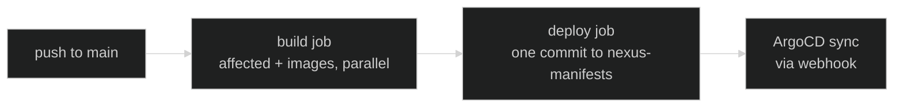
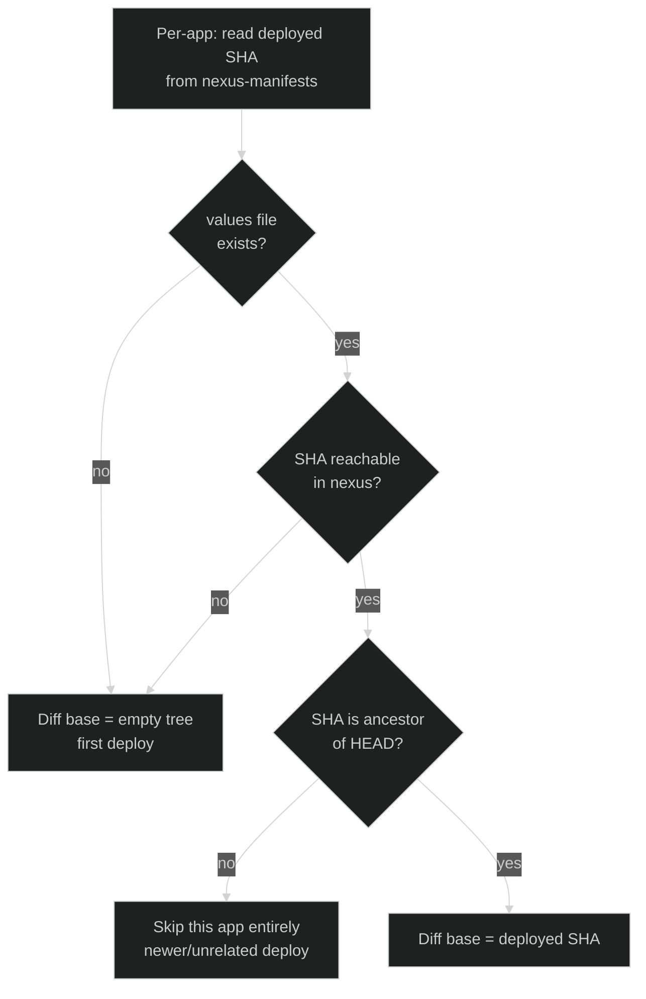

Image-shipping apps (portfolio, documentation, cloudflare-controller) are deployed through a
**separate manifests repo** rather than CI patching ArgoCD directly. This page covers why, what that
repo looks like, and how a push to `main` actually reaches the cluster.

## Why a separate repo

The previous flow had CI compute "what's affected" against the previous commit on `main`, then
imperatively `argocd app set` the new image tag. That breaks under parallel merges: if build B's
diff base is the commit build A produced, and B's manifest is computed before A finishes pushing its
image, B can end up referencing an image that doesn't exist yet — and GitHub Actions concurrency
can't enforce strict ordering across more than two in-flight runs.

The fix: make each build's deploy decision **self-contained**. An app redeploys iff its files
changed since _that app's own_ last successful deploy, not since the previous commit anywhere. The
source of truth for "last successful deploy per app" is a small, dumb git repo —
<a href="https://github.com/kbntx-org/nexus-manifests" target="_blank" rel="noopener"><code>nexus-manifests</code></a>
— that ArgoCD reads as a values overlay. It holds one tiny file per app (`portfolio/values.yaml` →
`image: { tag: <sha> }`, and so on), no `Chart.yaml`, no templates. Its git history _is_ the deploy
log; rollback is `git revert` on this repo alone.

## Pipeline shape

<a href="https://github.com/kbntx-org/nexus/blob/main/.github/workflows/build.yml" target="_blank" rel="noopener"><code>build.yml</code></a>
computes affected and deploy targets, then builds and pushes images tagged with the commit SHA —
portfolio, documentation, and cloudflare-controller each build as a parallel step, individually
skipped if not a deploy target.

<a href="https://github.com/kbntx-org/nexus/blob/main/.github/workflows/deploy.yml" target="_blank" rel="noopener"><code>deploy.yml</code></a>
is **one job** (`deploy`) with conditional steps, not separate jobs per trigger type. On a normal
push or PR event it clones `nexus-manifests`, bumps `image.tag` for each target, and produces one
commit per wave — using a rebase-retry loop so two waves landing back-to-back serialize cleanly at
the git layer. Auto-sync + a GitHub webhook mean ArgoCD picks up the change within seconds; a manual
`argocd app set` is never part of this flow, since `selfHeal: true` would just revert it on the next
reconcile.

The same job also has a "deploy bastion" step — see
[What's not GitOps-managed](#whats-not-gitops-managed).

## Affected detection per app

Three real edge cases, not just one: a missing values file (bootstrap, new app) or an unreachable
SHA both fall back to the empty tree, so every tracked file counts as added and the app deploys. But
if the recorded SHA _is_ reachable and just isn't an ancestor of `HEAD` — a newer or unrelated
deploy, e.g. after a force-push or a manifests-repo edit out of band — the app is **skipped from
this build's deploy targets entirely** rather than treated as a first deploy. PR mode never consults
`nexus-manifests` at all: the diff base is always the PR's merge target.

## Auth

A `nexus-ci` GitHub App, installed on both repos with write access to `nexus-manifests`, mints
short-lived installation tokens on the fly — one for `compute-affected`'s read-side clone, one for
the deploy job's write.

## Rollback and hotfix

The manifests repo is small and human-editable, so there are three real options when production
needs to move right now: `git revert` the bad commit in `nexus-manifests` (ArgoCD syncs the revert
within seconds via the webhook), hand-edit `image.tag` to a known-good SHA and push, or re-run CI
for the desired `nexus` commit. `argocd app set` is not one of them — `selfHeal: true` reverts any
live override on the next reconcile.

## Pull requests

PRs run the same build → deploy chain with three differences: the build step never pushes the image
(`docker buildx build` without `--push`, so buildability is still validated), the image tag is the
PR head SHA, and the deploy step writes to a `pr-<number>` branch in `nexus-manifests` instead of
`main` (created from `main` on first build, reused after). Since the image is never pushed, that tag
isn't consumable by anything yet — it's scaffolding for a not-yet-wired PR-preview `ApplicationSet`.
<a href="https://github.com/kbntx-org/nexus/blob/main/.github/workflows/cleanup-pr-manifests.yml" target="_blank" rel="noopener"><code>cleanup-pr-manifests.yml</code></a>
deletes the `pr-<number>` branch when the PR closes, merged or not.

## What's not GitOps-managed

<a href="https://github.com/kbntx-org/nexus/tree/main/platform/core/bastion" target="_blank" rel="noopener"><code>platform/core/bastion/</code></a>
is deployed by the same `deploy` job, but through a different mechanism — its "Deploy bastion" step
SSHes in and runs `docker compose up` directly, rather than going through ArgoCD. That step runs
whenever `bastion` is a deploy target _or_ the workflow was triggered manually — it is not mutually
exclusive with the `nexus-manifests` bump above; both can run in the same invocation. It's on the
list to migrate into the cluster as a real ArgoCD app in a separate effort.

## References

- <a href="https://github.com/kbntx-org/nexus/blob/main/platform/services/app-of-apps/values.yaml" target="_blank" rel="noopener"><code>platform/services/app-of-apps/values.yaml</code></a>
  — multi-source `Application` definitions for the image-shipping apps
- <a href="https://github.com/kbntx-org/nexus/blob/main/.github/workflows/checks.yml" target="_blank" rel="noopener"><code>.github/workflows/checks.yml</code></a>
  — entrypoint wiring lint/test/build/deploy together
- <a href="https://github.com/kbntx-org/nexus/blob/main/.github/actions/compute-affected/action.yaml" target="_blank" rel="noopener"><code>.github/actions/compute-affected/action.yaml</code></a>
  — per-app base resolution and the three fallback cases
- <a href="https://github.com/kbntx-org/nexus/blob/main/.github/workflows/build.yml" target="_blank" rel="noopener"><code>.github/workflows/build.yml</code></a>
  — builds/pushes the three images as parallel steps
- <a href="https://github.com/kbntx-org/nexus/blob/main/.github/workflows/deploy.yml" target="_blank" rel="noopener"><code>.github/workflows/deploy.yml</code></a>
  — the single `deploy` job (manifests bump + bastion step)
- <a href="https://github.com/kbntx-org/nexus/blob/main/.github/workflows/cleanup-pr-manifests.yml" target="_blank" rel="noopener"><code>.github/workflows/cleanup-pr-manifests.yml</code></a>
  — deletes the PR branch on close
