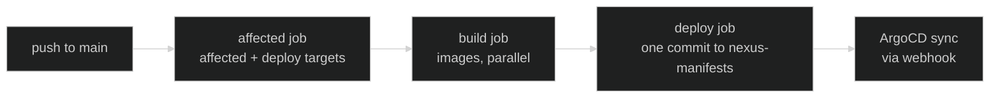

Image-shipping apps (portfolio, documentation, cloudflare-controller) are deployed through a
**separate manifests repo** rather than CI patching ArgoCD directly. This page covers why, what that
repo looks like, and how a push to `main` actually reaches the cluster.

## Why a separate repo

The previous flow had CI compute "what's affected," then imperatively `argocd app set` the new image
tag directly against the live `Application` — an unversioned, unserialized mutation. Two builds
landing close together could have their `argocd app set` calls interleave in the wrong order,
leaving an older image live even though a newer commit had already "deployed."

The fix: stop mutating ArgoCD directly. Route every deploy through a small, dumb git repo —
<a href="https://github.com/kbntx-org/nexus-manifests" target="_blank" rel="noopener"><code>nexus-manifests</code></a>
— that ArgoCD reads as a values overlay instead. It holds one tiny file per app
(`portfolio/values.yaml` → `image: { tag: <sha> }`, and so on), no `Chart.yaml`, no templates.
Because a deploy is now a git commit pushed through a single concurrency group with a rebase-retry
loop (see [Pipeline shape](#pipeline-shape) below), two waves landing back-to-back serialize
correctly at the git layer instead of racing as live API calls — whichever lands last is simply
`main`'s current desired state, with no possibility of an out-of-order overwrite. Its git history
_is_ the deploy log; rollback is `git revert` on this repo alone.

## Pipeline shape

The [Affected job](02-ci-cd-pipeline.md#affected-detection) computes deploy targets up front;
<a href="https://github.com/kbntx-org/nexus/blob/main/.github/workflows/build.yml" target="_blank" rel="noopener"><code>build.yml</code></a>
runs `pnpm nx run-many --target=build-ci --projects=<the list> --parallel`, tagged with the commit
SHA via an `IMAGE_TAG` env var. Nx's own task graph decides what actually happens per project —
portfolio, documentation, and cloudflare-controller each run
<a href="https://github.com/kbntx-org/nexus/blob/main/tools/docker-build-and-push.sh" target="_blank" rel="noopener"><code>tools/docker-build-and-push.sh</code></a>,
`bastion` (if present in the list) runs its no-op `build-ci` target and does nothing here — its
actual deploy happens later in this same pipeline, via `deploy.yml`'s SSH step below. `build-ci`
only produces and pushes the image — it never touches `nexus-manifests`; that's entirely
`deploy.yml`'s job, described next.

<a href="https://github.com/kbntx-org/nexus/blob/main/.github/workflows/deploy.yml" target="_blank" rel="noopener"><code>deploy.yml</code></a>
is **one job** (`deploy`) with conditional steps, not separate jobs per trigger type. On a normal
push or PR event it clones `nexus-manifests`, bumps `image.tag` for each target, and produces one
commit per wave — using a rebase-retry loop so two waves landing back-to-back serialize cleanly at
the git layer. Auto-sync + a GitHub webhook mean ArgoCD picks up the change within seconds; a manual
`argocd app set` is never part of this flow, since `selfHeal: true` would just revert it on the next
reconcile.

The same job also has a "deploy bastion" step — see
[What's not GitOps-managed](#whats-not-gitops-managed).

## Deploy target computation

`nexus` never reads `nexus-manifests` to decide what to deploy — the
[Affected job](02-ci-cd-pipeline.md#affected-detection) has no read dependency on it at all. Every
app's deploy-target decision is `nx show projects --affected --with-target build-ci` against the
exact same shared [diff base](02-ci-cd-pipeline.md#diff-base) used for lint and test — there's no
separate per-app base read from a deployed SHA, and no hand-rolled path matching; it's Nx's own
affected-graph computation over each project's `build-ci` target `inputs`.

The tradeoff this accepts: if two commits land on `main` close enough together that the second's
diff-base walk doesn't yet see the first as green, both can independently decide the same app is a
deploy target and each push a commit bumping its tag. That's harmless rather than incorrect — the
rebase-retry loop above already serializes those two writes correctly, and since the second commit
is a descendant of the first, whichever tag lands last is the one that should be live anyway. Worst
case is one redundant image build for a tag that gets superseded moments later, not a wrong or
missing deploy.

What this design intentionally does _not_ self-heal: a deploy whose manifests push fails is caught
automatically (see [Pipeline gate](02-ci-cd-pipeline.md#diff-base) — a failed deploy makes that
commit ineligible as a future diff base, so the next run's diff widens to pick it back up), but a
manual `git revert` made directly in `nexus-manifests` (see
[Rollback and hotfix](#rollback-and-hotfix) below) leaves no trace in `nexus` at all — re-syncing
after a manual rollback is a deliberate follow-up, not something any of this makes automatic.

## Auth

A `nexus-ci` GitHub App, installed on both repos with write access to `nexus-manifests`, mints a
short-lived installation token on the fly for the deploy job's write — that's `nexus-manifests`'s
only consumer; nothing in `nexus`'s CI reads from it.

## Rollback and hotfix

The manifests repo is small and human-editable, so there are three real options when production
needs to move right now: `git revert` the bad commit in `nexus-manifests` (ArgoCD syncs the revert
within seconds via the webhook), hand-edit `image.tag` to a known-good SHA and push, or re-run CI
for the desired `nexus` commit. `argocd app set` is not one of them — `selfHeal: true` reverts any
live override on the next reconcile.

## Pull requests

PRs run the same build → deploy chain with three differences: the build step never pushes the image
(`docker buildx build` without `--push`, so buildability is still validated), the image tag is the
PR head SHA, and the deploy step writes to a `pr-<number>` branch in `nexus-manifests` instead of
`main` (created from `main` on first build, reused after). Since the image is never pushed, that tag
isn't consumable by anything yet — it's scaffolding for a not-yet-wired PR-preview `ApplicationSet`.
<a href="https://github.com/kbntx-org/nexus/blob/main/.github/workflows/cleanup-pr-manifests.yml" target="_blank" rel="noopener"><code>cleanup-pr-manifests.yml</code></a>
deletes the `pr-<number>` branch when the PR closes, merged or not.

## What's not GitOps-managed

<a href="https://github.com/kbntx-org/nexus/tree/main/platform/core/bastion" target="_blank" rel="noopener"><code>platform/core/bastion/</code></a>
is deployed by the same `deploy` job, but through a different mechanism — its "Deploy bastion" step
SSHes in and runs `docker compose up` directly, rather than going through ArgoCD. That step runs
whenever `bastion` is a deploy target _or_ the workflow was triggered manually — it is not mutually
exclusive with the `nexus-manifests` bump above; both can run in the same invocation. It's on the
list to migrate into the cluster as a real ArgoCD app in a separate effort.

## References

- <a href="https://github.com/kbntx-org/nexus/blob/main/platform/services/app-of-apps/values.yaml" target="_blank" rel="noopener"><code>platform/services/app-of-apps/values.yaml</code></a>
  — multi-source `Application` definitions for the image-shipping apps
- <a href="https://github.com/kbntx-org/nexus/blob/main/.github/workflows/checks.yml" target="_blank" rel="noopener"><code>.github/workflows/checks.yml</code></a>
  — entrypoint wiring affected/lint/test/build/deploy together
- <a href="https://github.com/kbntx-org/nexus/blob/main/.github/workflows/affected.yml" target="_blank" rel="noopener"><code>.github/workflows/affected.yml</code></a>
  — deploy-target computation, diffed against the shared trunk base
- <a href="https://github.com/kbntx-org/nexus/blob/main/.github/workflows/build.yml" target="_blank" rel="noopener"><code>.github/workflows/build.yml</code></a>
  — runs `nx run-many --target=build-ci` for the affected deploy targets
- <a href="https://github.com/kbntx-org/nexus/blob/main/tools/docker-build-and-push.sh" target="_blank" rel="noopener"><code>tools/docker-build-and-push.sh</code></a>
  — the shared build/push script each image-shipping app's `deploy` target runs
- <a href="https://github.com/kbntx-org/nexus/blob/main/.github/workflows/deploy.yml" target="_blank" rel="noopener"><code>.github/workflows/deploy.yml</code></a>
  — the single `deploy` job (manifests bump + bastion step)
- <a href="https://github.com/kbntx-org/nexus/blob/main/.github/workflows/cleanup-pr-manifests.yml" target="_blank" rel="noopener"><code>.github/workflows/cleanup-pr-manifests.yml</code></a>
  — deletes the PR branch on close
