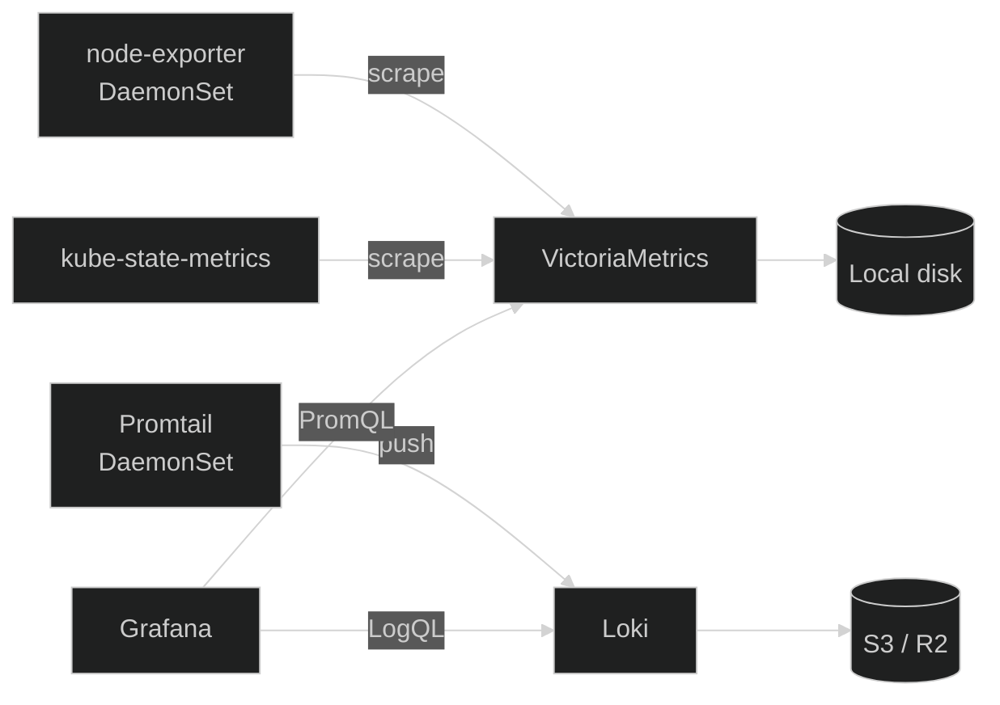

Observability in Nexus is a single Helm chart at
<a href="https://github.com/kbntx-org/nexus/tree/main/platform/services/monitoring" target="_blank" rel="noopener"><code>platform/services/monitoring/</code></a>,
built on the Grafana OSS stack rather than something like Datadog. Two reasons drive that: cost, and
control over visualization — Grafana lets us mix metrics, logs, and arbitrary external data sources
(custom APIs included) on the same dashboard, instead of being boxed into one vendor's model of what
a panel can query.

The broader strategy is to back every component by S3-compatible object storage where possible —
it's less to operate than block-storage-backed alternatives, and storage then scales independently
of the cluster. Loki already works this way; metrics don't yet (see [Metrics](#metrics) below).

## Stack

| Signal     | Tool                                                                                           | Backing storage                                              |
| ---------- | ---------------------------------------------------------------------------------------------- | ------------------------------------------------------------ |
| Metrics    | <a href="https://docs.victoriametrics.com/" target="_blank" rel="noopener">VictoriaMetrics</a> | Local disk today — see [Metrics](#metrics)                   |
| Logs       | <a href="https://grafana.com/docs/loki/latest/" target="_blank" rel="noopener">Loki</a>        | S3-compatible (R2)                                           |
| Traces     | Not deployed yet                                                                               | —                                                            |
| Dashboards | <a href="https://grafana.com/docs/grafana/latest/" target="_blank" rel="noopener">Grafana</a>  | CloudNativePG — see [Databases](../databases/01-overview.md) |

## Metrics

<a href="https://docs.victoriametrics.com/" target="_blank" rel="noopener">VictoriaMetrics</a> (the
<a href="https://github.com/VictoriaMetrics/helm-charts/tree/master/charts/victoria-metrics-single" target="_blank" rel="noopener"><code>victoria-metrics-single</code></a>
chart) scrapes
<a href="https://github.com/prometheus/node_exporter" target="_blank" rel="noopener"><code>node-exporter</code></a>
(host-level signals) and
<a href="https://github.com/kubernetes/kube-state-metrics" target="_blank" rel="noopener"><code>kube-state-metrics</code></a>
(the Kubernetes object graph as metrics) on a schedule, speaking Prometheus'
scrape/remote-write/query APIs so PromQL, dashboards, and exporters all work unchanged.

It's the one signal not yet S3-backed — storage is a local volume today. The plan is to move onto
<a href="https://grafana.com/oss/mimir/" target="_blank" rel="noopener">Mimir</a> (same Grafana OSS
family, natively S3-backed, still speaks PromQL) to close that gap, rather than staying on a
single-node setup indefinitely. The idea is also to move the different daemonsets to alloy that
cover all our cases (metrics + logs collection).

At the moment we cover only core metrics (cpu, I/O, memory, disk) at different levels (nodes, pods,
containers).

## Logs

<a href="https://grafana.com/docs/loki/latest/clients/promtail/" target="_blank" rel="noopener">Promtail</a>
runs as a DaemonSet, tails container logs, attaches Kubernetes metadata, and pushes to Loki, which
runs in
<a href="https://grafana.com/docs/loki/latest/get-started/deployment-modes/#simple-scalable" target="_blank" rel="noopener">SimpleScalable</a>
mode backed by S3-compatible storage for chunks and the index.

## Traces

Not wired up yet. The natural next piece is
<a href="https://grafana.com/oss/tempo/" target="_blank" rel="noopener">Tempo</a>, same Grafana OSS
family and S3-backed like Loki already is. It is work in progress, traces are quite important for
representing things like CI/CD visibility (global data, tests failures, etc).

## Adding a dashboard

- **Imported through the UI.** The Grafana sidecar runs with `allowUiUpdates: true`, so dashboards
  saved interactively persist and survive pod restarts. Good for iterating.
- **Provisioned via the chart.** Anything that should be source-of-truth belongs in the
  <a href="https://github.com/kbntx-org/nexus/blob/main/platform/services/monitoring/values.yaml" target="_blank" rel="noopener">monitoring
  values file</a> so it's reapplied on every ArgoCD sync. UI-edited dashboards should eventually be
  promoted there.

## Alerts

Alerting goes through
<a href="https://grafana.com/docs/grafana/latest/alerting/" target="_blank" rel="noopener">Grafana's
own unified alerting</a> rather than a separate Alertmanager or `vmalert` — one less component to
run, and rules live next to the dashboards that inform them.

## References

- <a href="https://github.com/kbntx-org/nexus/tree/main/platform/services/monitoring" target="_blank" rel="noopener"><code>platform/services/monitoring/</code></a>
  — full monitoring Helm chart
- [Databases](../databases/01-overview.md) — CNPG pattern backing Grafana's own state
- [Secrets](../secrets/01-overview.md) — how Loki's S3 credentials reach the cluster
