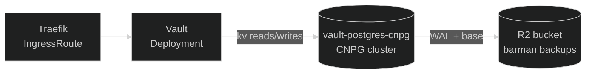
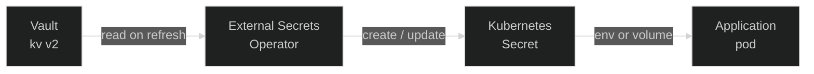

Secrets in Nexus follow one rule: **the cluster never owns the source of truth.** No secret value is
committed to Git or lives exclusively inside an application's manifest. Credentials, tokens, and
connection strings live in
<a href="https://developer.hashicorp.com/vault" target="_blank" rel="noopener">HashiCorp Vault</a>,
and the cluster reaches in for them through the
<a href="https://external-secrets.io/" target="_blank" rel="noopener">External Secrets Operator</a>
(ESO). Git only ever holds a declarative description of _which_ secret a workload needs — the value
is materialised at runtime.

That split is what lets a namespace be torn down and rebuilt without losing a credential: it just
comes back up by re-reading from Vault.

## Vault in the cluster

Vault runs in-cluster as a Helm chart at
<a href="https://github.com/kbntx-org/nexus/tree/main/platform/core/vault/server" target="_blank" rel="noopener"><code>platform/core/vault/server/</code></a>:
the Vault Deployment, a
<a href="https://cloudnative-pg.io/" target="_blank" rel="noopener">CloudNativePG</a> `Cluster` for
storage, and the `IngressRoute` fronting the API.



**Why Postgres, not the embedded/Raft backends:** the platform already standardizes on Postgres for
backups, so reusing it here beats bolting on a Vault-specific snapshotting workflow — and a remote
backend avoids disk-local data like SQLite, which makes backup simpler on top. It's bootstrapped
once by CNPG's `postInitApplicationSQLRefs`, reading
<a href="https://github.com/kbntx-org/nexus/blob/main/platform/core/vault/server/files/vault.sql" target="_blank" rel="noopener"><code>vault.sql</code></a>
— skipped on recovered/re-attached volumes.

**The bootstrap secret.** One secret doesn't come from Vault: `vault-secret` in the `vault`
namespace, applied manually, holding the Postgres connection URI, CNPG superuser credentials, and R2
backup keys — Vault needs somewhere to store its own data before it can serve its first request.

Vault starts **sealed** on every boot and needs a manual unseal — no auto-unseal configured, the
deliberate trade-off for keeping the unseal keys off the cluster entirely.

## External Secrets Operator

ESO reconciles two CRDs: a `SecretStore`/`ClusterSecretStore` (how to talk to Vault) and an
`ExternalSecret` (what to fetch, and what Kubernetes `Secret` to build from it). Workloads then
mount that `Secret` like any other, never knowing Vault is in the picture.



**Templating is the strong point.** An `ExternalSecret`'s `target.template` isn't limited to a flat
key/value `Secret`. It can also be useful to inject a sensitive variable in a template that is
committed in git. Karpenter and the ARC runner pools use exactly this to render a whole cloud-init
`userData` document (see
<a href="https://github.com/kbntx-org/nexus/blob/main/platform/core/karpenter/templates/secrets.yaml" target="_blank" rel="noopener"><code>karpenter/templates/secrets.yaml</code></a>):
a Vault-sourced join token and registry credentials are injected in a template that is saved in git.

### How ESO authenticates to Vault

Each consuming app has its own `ServiceAccount`. ESO presents its projected token (audience `vault`)
via Vault's
<a href="https://developer.hashicorp.com/vault/docs/auth/kubernetes" target="_blank" rel="noopener">Kubernetes
auth method</a>, which Vault validates via the cluster's TokenReview API, hence
<a href="https://github.com/kbntx-org/nexus/blob/main/platform/core/external-secrets/deploy/templates/rbac.yaml" target="_blank" rel="noopener"><code>external-secrets/deploy/templates/rbac.yaml</code></a>
binding `system:auth-delegator` to the `external-secrets` ServiceAccount.

The Vault backend side of this is provisioned a single time by Terraform in
<a href="https://github.com/kbntx-org/nexus/tree/main/platform/core/external-secrets/provision" target="_blank" rel="noopener"><code>platform/core/external-secrets/provision/</code></a>
since Vault's own API has to be configured directly — and it's a long-lived, one-time setup. Then
each secret created in the platform KV at the path <namespace>/* is accessible by the namespace
service accounts to ensure isolation between apps.

## Adding a new secret

Write the value into Vault under a KV path matching the consuming `ServiceAccount`'s namespace (the
templated policy scopes access automatically), then copy this shape into the consumer's chart:

```yaml
apiVersion: external-secrets.io/v1
kind: SecretStore
metadata:
  name: my-app-secret-store
spec:
  provider:
    vault:
      server: https://vault.kbntx.com
      path: platform
      version: v2
      auth:
        kubernetes:
          mountPath: kubernetes
          role: eso
          serviceAccountRef:
            name: my-app-secret-sa
            audiences: [vault]
---
apiVersion: external-secrets.io/v1
kind: ExternalSecret
metadata:
  name: my-app-secret
spec:
  refreshInterval: 30s
  secretStoreRef:
    name: my-app-secret-store
    kind: SecretStore
  target:
    name: my-app-secret
  dataFrom:
    - extract:
        key: my-app # matches the ServiceAccount's namespace
```

Consume `my-app-secret` from the workload's manifest — ESO handles the rest on its refresh interval.
For field-level details (templating, extraction, refresh behavior) the
<a href="https://external-secrets.io/latest/" target="_blank" rel="noopener">ESO docs</a> are
authoritative; there's no Nexus-specific wrapper.

## Backups and disaster recovery

Vault's durability rests on the CNPG cluster backing its KV store and the unseal keys/root token
kept out-of-band. The backup/restore/hibernate mechanics are the same for every CNPG-backed database
and covered once in [Databases](../databases/01-overview.md). Vault-specific: after a restore,
re-apply `vault-secret` pointed at the restored cluster and unseal manually — both the chart and
schema bootstrap are idempotent against an existing volume.

## Encryption at rest

k3s runs with `secrets-encryption: true`, so Kubernetes `Secret` objects — everything ESO writes
included — are encrypted at rest in etcd rather than stored as plain base64. Cluster-wide, not
opt-in; see [Cluster](../cluster/01-overview.md). This does **not** cover Postgres data itself — see
[Databases](../databases/01-overview.md) for that gap.

## Local environment

**Local dev** drops the CNPG cluster and runs Vault's built-in `-dev` mode against an in-memory
backend, seeded by
<a href="https://github.com/kbntx-org/nexus/blob/main/platform/core/vault/server/templates/seed-script.yaml" target="_blank" rel="noopener"><code>seed-script.yaml</code></a>
so a fresh local cluster has a working Vault with zero operator steps and the full external secret
operator up and running.

## References

- <a href="https://github.com/kbntx-org/nexus/tree/main/platform/core/vault/server" target="_blank" rel="noopener"><code>platform/core/vault/server/</code></a>
  — Vault Helm chart — CNPG `Cluster` + `ScheduledBackup` for Vault's storage
- <a href="https://github.com/kbntx-org/nexus/tree/main/platform/core/external-secrets/deploy" target="_blank" rel="noopener"><code>platform/core/external-secrets/deploy/</code></a>
  — ESO Helm chart and TokenReview RBAC
- <a href="https://github.com/kbntx-org/nexus/blob/main/platform/core/external-secrets/provision/main.tf" target="_blank" rel="noopener"><code>platform/core/external-secrets/provision/main.tf</code></a>
  — the `eso` role and templated policy
