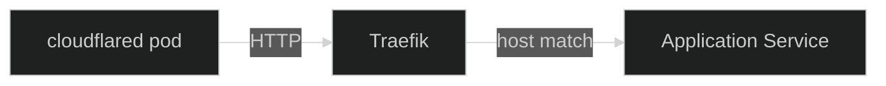
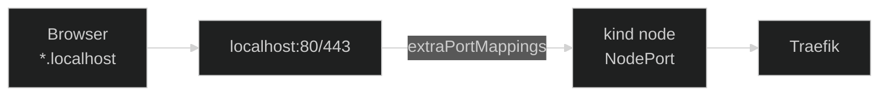

[Traefik](https://doc.traefik.io/traefik/){ target="\_blank" rel="noopener" }
is the **in-cluster ingress controller** in Nexus. It receives plain HTTP
from the [`cloudflared`](https://github.com/cloudflare/cloudflared){ target="\_blank" rel="noopener" }
tunnel pod, matches the request against the
[`IngressRoute`](https://doc.traefik.io/traefik/providers/kubernetes-crd/){ target="\_blank" rel="noopener" }
resources in the cluster, and forwards it to the right `Service`.

## Why Traefik

A few things made Traefik the path of least resistance here:

- **Native CRD provider.** Traefik ships its own `IngressRoute` custom
  resource, giving routes access to Traefik's full matcher syntax
  (`Host`, `PathPrefix`, header matching, and so on) and a direct path
  to attach `Middleware` and other Traefik CRDs later without bolting
  on provider-specific annotations.
- **Sane defaults.** The Helm chart ships with reasonable production
  defaults (deployment, service, RBAC, metrics) so the configuration in
  this repo is small and focused on the few things that actually need
  customising.
- **Built-in dashboard.** A live view of routers, services, and
  middlewares is one container flag away — useful when an `Ingress` is
  not behaving and you want to see what Traefik actually computed from
  it.
- **Low ceremony.** No per-service annotations to learn, no controller
  zoo to coordinate. Traefik is simple enough to disappear into the
  background once it is wired up.

## Where Traefik fits

TLS terminates at the Cloudflare edge, so by the time a request reaches
Traefik it is already plain HTTP. The hop chain inside the cluster is
short:



Everything upstream of `cloudflared` — the Cloudflare edge, the outbound
tunnel, why there is no public load balancer — is covered in the
[Networking](../networking/01-overview.md) section. From Traefik's point
of view it is just another HTTP client on the cluster network.

## Configuration choices

The chart in
[`platform/core/traefik/`](https://github.com/kbntx-org/nexus/tree/main/platform/core/traefik){ target="\_blank" rel="noopener" }
wraps the upstream
[Traefik Helm chart](https://github.com/traefik/traefik-helm-chart){ target="\_blank" rel="noopener" }
with a small set of opinionated overrides in
[`values.yaml`](https://github.com/kbntx-org/nexus/blob/main/platform/core/traefik/values.yaml){ target="\_blank" rel="noopener" }.
The decisions worth calling out:

- **CRD routing, no stock `Ingress`.** The `kubernetesCRD` provider is
  enabled and the `kubernetesIngress` provider is **off**. Apps express
  their routing with `IngressRoute` rather than the standard Kubernetes
  `Ingress` API. There is only one ingress controller in this cluster,
  so the portability a stock `Ingress` buys (swapping controllers
  without touching app manifests) is not a real need here, and
  `IngressRoute`'s matcher syntax is what unlocks the encoded-URL
  entrypoint handling and any future per-route `Middleware` chaining
  below.
- **No `IngressClass` selection needed.** With a single Traefik
  instance in the cluster, `IngressRoute` resources don't need an
  `ingressClassName` to disambiguate which controller should pick them
  up — Traefik's CRD provider watches every `IngressRoute` in the
  cluster by default.
- **Tolerant URL handling on the `web` entrypoint.** A handful of
  encoded-character allowances are turned on (encoded slashes,
  semicolons, percent signs, and so on). Some of the apps behind
  Traefik legitimately produce URLs that contain encoded characters
  in path segments, and the upstream defaults reject them as
  malformed. Loosening the entrypoint here, rather than asking every
  affected app to work around it, is the simpler call.
- **JSON access logs with a trimmed header allow-list.** Access logs
  are emitted as JSON so they can be parsed by whatever log pipeline
  consumes them. Header capture defaults to `drop`; only
  `CF-IPCountry`, `X-Forwarded-For`, `Referer`, and `User-Agent` are
  kept. That is enough to debug routing and trace traffic origin
  without persisting cookies, auth headers, or anything else
  sensitive that happens to ride along on a request.
- **Multiple replicas.** The deployment runs more than one replica so
  there is always a Traefik pod ready when `cloudflared` forwards a
  request. The `cloudflared` side of the tunnel is also replicated
  (see [Networking](../networking/01-overview.md)); pairing both ends
  keeps the public path tolerant of pod churn on either side.

The `websecure` entrypoint is **not** exposed: TLS is Cloudflare's job,
and there is no other source of HTTPS traffic inside the cluster.

## Exposing a service

Apps use Traefik's `IngressRoute` CRD. The portfolio chart's
[`template.yaml`](https://github.com/kbntx-org/nexus/blob/main/apps/portfolio/chart/templates/template.yaml){ target="\_blank" rel="noopener" }
is a representative example:

```yaml
apiVersion: traefik.io/v1alpha1
kind: IngressRoute
metadata:
  name: portfolio-ingress
spec:
  routes:
    - match: Host(`my-app.example.com`)
      kind: Rule
      services:
        - name: portfolio-service
          port: 80
```

Two things to keep in mind:

- `entryPoints` is left unset, so the route binds to every entrypoint
  Traefik has (`web` and `websecure`). That is fine here: `websecure`
  is not exposed at the `Service` level (see below), so it is not
  actually reachable regardless of which entrypoints a route lists.
- An `IngressRoute` only handles in-cluster routing. To make the
  hostname publicly reachable, it also has to be wired up in the
  Cloudflare Tunnel ingress config so Cloudflare knows to forward it.
  That side lives in [Networking](../networking/01-overview.md).

## Dashboard

The Traefik dashboard is exposed via a small
[`Service` + `IngressRoute` template](https://github.com/kbntx-org/nexus/blob/main/platform/core/traefik/templates/dashboard.yaml){ target="\_blank" rel="noopener" }
that targets the Traefik API port. The chart also passes
`--api.insecure=true` so the dashboard does not require its own auth
layer.

That flag would be alarming on a publicly exposed installation, but the
dashboard hostname is **not public**: it is reachable only behind
Cloudflare Zero Trust + WARP (see [Networking](../networking/01-overview.md)).
Authentication and authorisation happen at the edge, before any request
ever crosses the tunnel into the cluster — the in-cluster service simply
trusts that anything reaching it has already been vetted.

## Local development parity

The same chart is reused for the [Tilt](https://tilt.dev/){ target="\_blank" rel="noopener" }-driven
local [`kind`](https://kind.sigs.k8s.io/){ target="\_blank" rel="noopener" }
cluster, with overrides in
[`values.local.yaml`](https://github.com/kbntx-org/nexus/blob/main/platform/core/traefik/values.local.yaml){ target="\_blank" rel="noopener" }:
the Traefik `Service` is switched to `NodePort`, the `internal-web` /
`internal-secure` entrypoints (production-only, fronted by
`cloudflared`) are disabled, and `web` / `websecure` are each pinned to
a known NodePort instead. The cluster bootstrap script
[`platform/core/local/cluster.sh`](https://github.com/kbntx-org/nexus/blob/main/platform/core/local/cluster.sh){ target="\_blank" rel="noopener" }
maps those NodePorts to `localhost:80` and `localhost:443` on the host
via `kind`'s `extraPortMappings`.



The pay-off is that `*.localhost` URLs hit the local Traefik directly,
go through the same `IngressRoute` resources the production cluster
uses, and exercise the same routing rules — without `kubectl
port-forward` gymnastics. The full public-traffic path can be validated end-to-end
before anything ships.

### Local TLS

Unlike production, where TLS terminates at the Cloudflare edge, the
local cluster terminates TLS itself so `https://*.localhost` works out
of the box. `cluster.sh` installs
[mkcert](https://github.com/FiloSottile/mkcert){ target="\_blank" rel="noopener" },
trusts its local certificate authority in the host's trust store, and
generates a certificate for `localhost` and `*.localhost`. That
certificate is loaded into the `traefik` namespace as the `default-tls`
`Secret` and wired up as the entrypoint's default certificate via
`tlsStore.default.defaultCertificate` in `values.local.yaml` — see the
upstream chart's [TLS store example](https://github.com/traefik/traefik-helm-chart/blob/master/EXAMPLES.md){ target="\_blank" rel="noopener" }
for the shape of that value. The `web` entrypoint permanently redirects
to `websecure`, mirroring the `internal-web` → `internal-secure`
redirect used in production.

Because mkcert's certificate authority is only trusted on the machine
that ran `cluster.sh`, this only makes the browser trust the
certificate locally — it is not a substitute for the Cloudflare-issued
certificate used in production.

What is still missing locally is the Cloudflare side of the path: in
production, requests reach Traefik via the `cloudflared` tunnel; locally
they arrive directly from the host. Adding a local `cloudflared` stack
on top of this for full parity is a future option, but worth the cost
only if a bug is ever traced specifically to that hop.

## References

- [`platform/core/traefik/`](https://github.com/kbntx-org/nexus/tree/main/platform/core/traefik){ target="\_blank" rel="noopener" } — Traefik Helm chart wrapper
- [`platform/core/traefik/values.yaml`](https://github.com/kbntx-org/nexus/blob/main/platform/core/traefik/values.yaml){ target="\_blank" rel="noopener" } — production overrides (ingress class, providers, entrypoint, logs, replicas)
- [`platform/core/traefik/values.local.yaml`](https://github.com/kbntx-org/nexus/blob/main/platform/core/traefik/values.local.yaml){ target="\_blank" rel="noopener" } — local-cluster overrides (NodePorts, dashboard host, disabled internal entrypoints, TLS store)
- [`platform/core/traefik/templates/dashboard.yaml`](https://github.com/kbntx-org/nexus/blob/main/platform/core/traefik/templates/dashboard.yaml){ target="\_blank" rel="noopener" } — `Service` + `IngressRoute` exposing the Traefik dashboard
- [`apps/portfolio/chart/templates/template.yaml`](https://github.com/kbntx-org/nexus/blob/main/apps/portfolio/chart/templates/template.yaml){ target="\_blank" rel="noopener" } — example app `IngressRoute`
- [`platform/core/local/cluster.sh`](https://github.com/kbntx-org/nexus/blob/main/platform/core/local/cluster.sh){ target="\_blank" rel="noopener" } — local `kind` cluster bootstrap with NodePort-to-host mapping and mkcert-issued local TLS certificate
