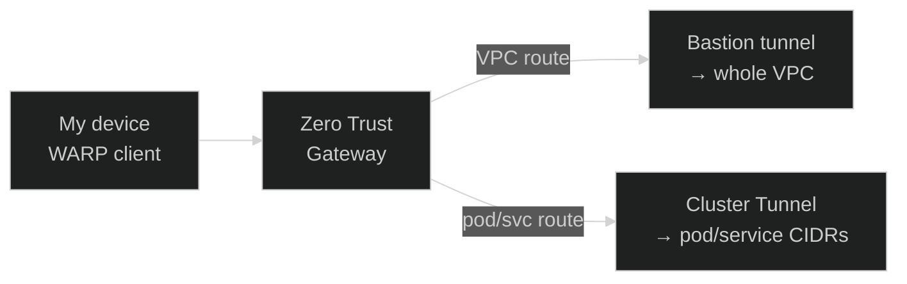
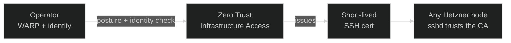

Networking in Nexus is built on one rule: **the cluster has no open inbound ports.** Nodes are
routed through a NAT gateway and the firewall closes every inbound port.

Everything in front of the cluster is
<a href="https://www.cloudflare.com/" target="_blank" rel="noopener">Cloudflare</a>, everything
behind it is a private
<a href="https://www.hetzner.com/cloud" target="_blank" rel="noopener">Hetzner</a> network, and
traffic only ever reaches it through outbound tunnels the cluster itself opens.

## Request path

_Figure 1 — Request path from the public internet to Traefik_

1. **Cloudflare edge.** Cloudflare owns the DNS and proxies every request, providing WAF, DDoS
   protection, and rate limiting. The cluster's origin IP is never exposed.
2. In-cluster
   <a href="https://developers.cloudflare.com/cloudflare-one/connections/connect-networks" target="_blank" rel="noopener"><code>cloudflared
   </code></a> pods hold a persistent **outbound** connection to the edge — no inbound listener, no
   firewall hole, no public IP.
3. The tunnel forwards the request over TLS to the ingress controller, which does the in-cluster
   routing. The TLS in-cluster is covered by
   <a href="https://cert-manager.io/" target="_blank" rel="noopener">cert-manager</a> through DNS
   letsencrypt challenge.

## Cloudflare-k8s-controller: the tunnel isn't hand-configured

One difficulty I faced was to maintain all the cloudflare access rules, policies. It was initially
done through terraform but it felt wrong since those rules/protections should live along the
workload they represent. So I built a custom
<a href="https://github.com/kbntx-org/nexus/tree/main/platform/core/cloudflare-controller" target="_blank" rel="noopener"><code>cloudflare-controller</code></a>,
a small controller-runtime operator built for this repo, from three CRDs:

- **`Tunnel`** — declares the cloudflared pods (replica count, a `PodDisruptionBudget`), the public
  ingress rules (hostname → in-cluster service, evaluated in order, with a catch-all appended
  automatically), and any private-network CIDRs to route through the tunnel. The cluster's own
  tunnel does double duty: it carries public ingress _and_ routes the cluster's pod/service CIDRs
  privately, so a WARP-connected device can resolve and reach Kubernetes-internal IPs directly.

- **`AccessApplication`** — a Cloudflare Zero Trust Access application protecting one hostname: how
  long a session lasts, and which `AccessPolicy` resources gate it (evaluated in the order listed).

- **`AccessPolicy`** — a reusable allow/deny/`non_identity`/`bypass` rule: `include` conditions OR
  together, `require` conditions all apply on top, `exclude` overrides a match. This is what
  actually decides "does this request/identity get through" for anything sitting behind Zero Trust
  (the ArgoCD UI, Grafana, the Traefik dashboard).

Adding a new privately-gated hostname is now a matter of writing an `AccessApplication` +
`AccessPolicy` pair in the consuming app's chart, not a Terraform or dashboard change.

## External-dns: DNS records aren't hand-managed either

<a href="https://github.com/kbntx-org/nexus/tree/main/platform/core/external-dns" target="_blank" rel="noopener"><code>external-dns</code></a>
watches `Service`, `Ingress`, Traefik CRD, and raw DNS-record CRD sources and syncs matching
Cloudflare DNS records automatically. It only acts on resources labeled `external-dns/enabled=true`,
and is restricted to managing `A`/`CNAME` records within the platform's own DNS zone. This enable to
deploy DNS records along the workloads.

## Private access via WARP

Operating the platform (for the rare debugging sessions) and accessing internal apps needs
reachability into the VPC without punching a hole in the no-public-ingress rule. Cloudflare
<a href="https://developers.cloudflare.com/cloudflare-one/connections/connect-devices/warp/" target="_blank" rel="noopener">Cloudflare
Zero Trust Solution</a> solves it with the same outbound-only pattern as public traffic:

Two separate tunnels carry private traffic, each routing a different scope:

- The bastion's tunnel routes the _entire_ VPC subnet (node IPs, the bastion itself — mainly used
  for SSH for non kubernetes operations). It is the one connector that cannot live in the cluster:
  it is also the VPC's NAT gateway, so it has to be reachable when nothing else is. It runs as a
  Compose stack on a VPS, and its
  <a href="https://github.com/kbntx-org/nexus/tree/main/platform/core/bastion" target="_blank" rel="noopener">Terraform</a>
  owns both the machine and the rollout — the same run that creates the tunnel deploys the stack
  that uses its token, so the token never has to leave Terraform. Redeploys go in place rather than
  replacing the server, since every private node loses egress while the NAT gateway is gone.

- The cluster's CR `Tunnel` routes the pod and service CIDRs. This allow me to publish private dns
  on cloudflare and reaching private applications and databases through the vpc directly. This
  configured in the WARP default profile (Terraform, in
  <a href="https://github.com/kbntx-org/nexus/tree/main/platform/core/warp" target="_blank" rel="noopener"><code>platform/core/warp/</code></a>)

## Reaching a node: no classic bastion

There is no SSH bastion here in the "jump host with authorized keys" sense. Every Hetzner server is
registered as a
<a href="https://developers.cloudflare.com/cloudflare-one/networks/connectors/cloudflare-tunnel/use-cases/ssh/ssh-infrastructure-access/" target="_blank" rel="noopener">Cloudflare
Zero Trust Infrastructure Access</a> target

This gates SSH by one policy: **identity** (an allow-listed email) AND **device posture** (the
connecting device must match a "gateway" posture rule, i.e. actually be on WARP). Passing both gets
you a short-lived SSH certificate, signed by an account-wide CA that every node's `sshd` already
trusts.

## References

- <a href="https://github.com/kbntx-org/nexus/tree/main/platform/core/cloudflare-controller" target="_blank" rel="noopener"><code>platform/core/cloudflare-controller/</code></a>
  — the `Tunnel`/`AccessApplication`/`AccessPolicy` operator
- <a href="https://github.com/kbntx-org/nexus/blob/main/platform/core/cloudflared/chart/templates/tunnel.yaml" target="_blank" rel="noopener"><code>platform/core/cloudflared/chart/templates/tunnel.yaml</code></a>
  — the cluster's own `Tunnel` resource (public ingress + private CIDR routes)
- <a href="https://github.com/kbntx-org/nexus/tree/main/platform/core/external-dns" target="_blank" rel="noopener"><code>platform/core/external-dns/</code></a>
  — Cloudflare DNS record automation
- <a href="https://github.com/kbntx-org/nexus/tree/main/platform/core/warp" target="_blank" rel="noopener"><code>platform/core/warp/</code></a>
  — WARP device profile, split-tunnel and local-domain-fallback config
- <a href="https://github.com/kbntx-org/nexus/tree/main/platform/core/bastion" target="_blank" rel="noopener"><code>platform/core/bastion/</code></a>
  — the bastion VM: NAT gateway, VPC-wide private-network tunnel, and the Terraform that rolls its
  Compose stack out
- <a href="https://github.com/kbntx-org/nexus/tree/main/platform/core/network" target="_blank" rel="noopener"><code>platform/core/network/</code></a>
  — the Hetzner VPC every private route ultimately targets
